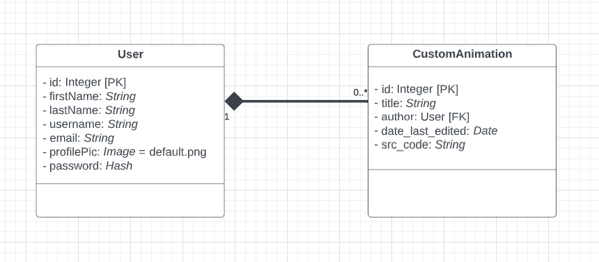

# anima_lib_team-91
A library that allows beginners perform basic web animation using normal language

## The UML Database Model

### The UML Diagram Explained

#### User Model
From the UML Diagram above; the `User` model represents a user registered on our website. The `User` model instance has an `id` field which serves as the Primary Key; it will also contain a `firstName`, `lastName`, `username` and an `email` field all of which stores String values. There are also `profile_pic` and `password` fields which store an Image and Hash characters respectively.

#### CustomAnimation Model
From the UML Diagram above; the `CustomAnimation` model represents a custom animation created by each `User` model instance on our website. Every `CustomAnimation` model instance will have an `id` field which serves as the Primary Key; it will also have a `title` field which stores String values. There are also `date_last_created` and `src_code` fields which store a Date and String (the CSS equivalent of the animation) respectively. It also has an `author` field which is a Foreign Key and stores the Primary Key of the `User` instance that created the `CustomAnimation`.

#### Their Relationship
- The line connecting the `User` and the `CustomAnimation` models shows a [composition relationship](https://t2informatik.de/en/smartpedia/uml-composition/) between the two models. This means that the `CustomAnimation` model can only exist if and only if the `User` model instance that creates it exist. Once that `User` instance is deleted (i.e non-existent), all `CustomAnimation` instances belonging to it gets deleted also. Note: The diamond-filled end indicates the superior model of the two.
- The '1' and '0..*' at both ends of the line indicates that there's a [one-to-many relationship](https://en.m.wikipedia.org/wiki/One-to-many_(data_model)#:~:text=In%20a%20relational%20database%2C%20a,rather%20of%20the%20relationship%20itself.) between the models. That is, one `User` model instance could have zero to many instances of the `CustomAnimation` model.
